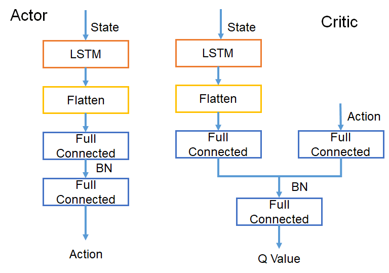
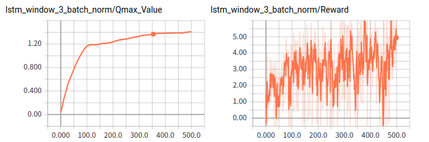
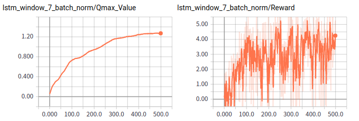
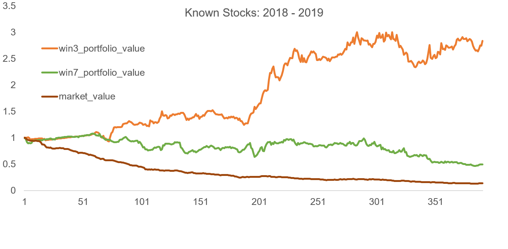
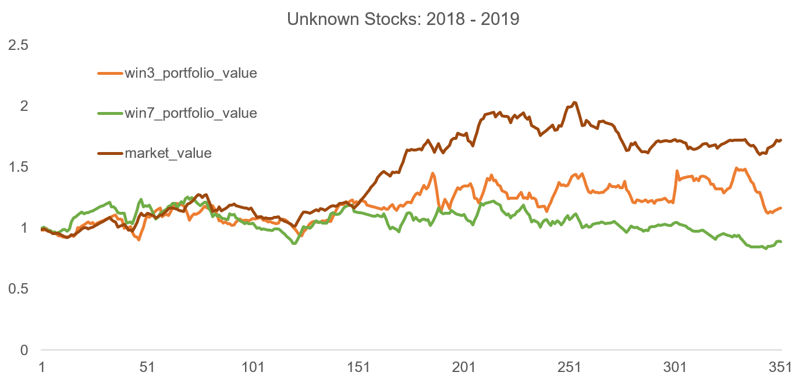
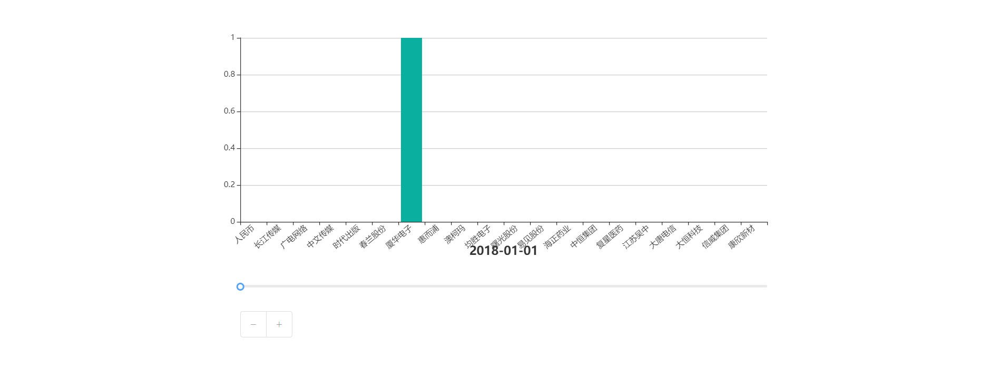

CS277 Deep Reinforcement Learning in Portfolio Management

## Introduction
* This repo is part of CS 277 project Deep Reinforcement Learning in Portfolio Management.
* It is the implement of Deep Deterministic Policy Gradient part.
* The data preprocessing part can be see in https://github.com/WJie12/autotrading_DQN .
* The DQN part can be see in https://github.com/WJie12/autotrading_DQN .

## Dataset
* We use dataset from SSE stock data. It is supported by course. 
* The data we extract stored in utils/datasets.

## Structure

```
|-config
|-data_for_vis
|-environment
|-model
|-results
|-stock_charts
|-utils
|-vis_results
|-weights
|-experiments.ipynb
|-requirements.txt
|-stock_trading.py
```

- /config: The hyper parameters of reinforcement learning setting file.
- /data_for_vis: The data we generate in our test experiments. We visualize it by Excel.
- /environment: The portfolio management simulation environment, it can inherit from [OpenAI Gym](https://gym.openai.com/).
- /model: The implements of DDPG. It is our trade agent.
- /results: The tensorflow logs of training.
- /stock_charts: The EchartJS project for visualize the weights output by the DDPG  agent. If you want to run it can reference the readme.
- /utils: 
  - data.py: data utils.
  - /datasets: The stock_history.h5 used for train and valid, the new_stock_history.h5 used for generalization test.
- /vis_results:  The image in our report.
- /weights: The  weights of tensorflow  model trained by DDPG. It include different window size.
- experiments.ipynb: The test file. It shows how to use the agent to predict and support some visualization example.
- requirements.txt: All dependencies
- stock_trading.py: train/test logic. It is the core file of trading.

## How to run

```python stock_trade.py -p=lstm -w=3 -b=True ```

> p: the predictor.
>
> w: the length of window.
>
> b: whether to use batch normalization 

How to test can reference the experiments.ipynb.

## Results

- Our model



- Train performance: train agent in data from 2014-2017.





- Test performance: test agent in data from 2018-2019



- Generalization performance: test agent in the new stock datasets which have not exit in train period.



- The action dynamic output by agent in test period.



## Reference

* The environment is inspired by https://github.com/wassname/rl-portfolio-management

  
